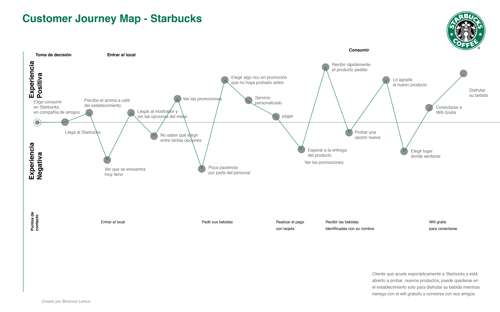

## Customer Journey Map Starbucks

Para crear el Customer Journey Map de un usuario esporádico de Starbucks, participé como cliente incógnito, además de realizar observación y entrevistas a este tipo de usuarios.

### Perfil de usuario esporádico

Mujer de 17 a 25 años, estudiante, gusta de reunirse con amigos en sus tiempos libres para conversar o pasar el tiempo, no es cliente asidua de Starbucks pero acude ciertas veces al año para consumir frappes o probar algún producto de temporada.

### Puntos de Contacto

Los puntos de contacto detectados son al entrar al establecimiento, al pedir las bebidas o productos consumidos, al pagar, al recibir sus bebidas y al tener acceso a wifi gratuito al momento del consumo.

[Customer Journey Map en Drive]https://drive.google.com/open?id=1l0HWULn9NpRK-XEZN9MMff4-TjAqh5Eq

### Experiencia del usuario

Dentro de la experiencia negativa lo que puedo destacar es el trato a los clientes, en ocasiones la impaciencia de los vendedores causa malestar al consumidor, por otra parte para este tipo de usuarios el costo de los productos puede ser una limitante para que el visitante sea recurrente, acuden a Starbucks cuando van con amigos o si realmente tienen un gran antojo por el producto a consumir o si hay algún producto nuevo que desean probar.

### Conclusiones

En mi experiencia, realizar un customer journey map trae muchos beneficios para identificar todo lo que tiene que hacer un usuario para lograr determinada tarea y los puntos de satisfacción o experiencias negativas al realizarla.

La tarea puede parecer pequeña pero se compone de distintas fases tanto visibles como invisibles que marcan la experiencia del usuario.